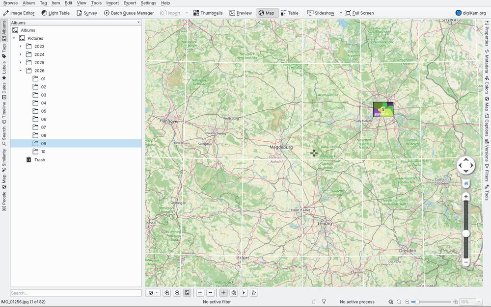

# Continuous builds and releases

The workflow `.github/workflows/photos-release.yml` builds digiKam with
Photos mode for Linux, Windows and macOS and publishes the results as GitHub
releases.

| Trigger | Result |
|---|---|
| Push to the development branch | Build on all three systems (Linux twice: Ubuntu 24.04+, and Ubuntu 22.04+ via Craft); the rolling pre-release `photos-continuous` is replaced by the new build |
| Push of a tag `photos-v<version>`, or a change of `streamline/release/draft-version` | A **draft** release `digiKam Photos <version>` with the packages of that commit's build (no rebuild) |
| Any run | Every package is also attached to the run as an artifact |

A pre-release is published only when the Linux job succeeds. Windows and
macOS are attached when their jobs succeed too. Those two jobs are marked
experimental (`continue-on-error`), so a failure there does not fail the
workflow.

To make a release:

```sh
git tag photos-v9.2.0-preview1 && git push origin photos-v9.2.0-preview1
```

or, where you can only push the branch, put the version into
`streamline/release/draft-version` and push it. The tag
`photos-v<version>` is then created on that commit when you publish the
draft.

`.github/workflows/photos-draft-release.yml` then picks the build of the
tagged commit, or of its newest built ancestor when the later commits only
touched docs. As soon as that build's Linux AppImage is ready, it creates a
draft pre-release with generated notes. It adds the Windows and macOS packages
when those jobs succeed. Review the draft on the GitHub releases page and
publish it. The packages keep their build names
(`digiKam-Photos-<version>-photos-<date>-<commit>-x86_64.AppImage`).

## Linux: AppImage

* Built on Ubuntu 24.04 from prebuilt packages only
  (`streamline/ci/install-deps-ubuntu.sh`):
  * Qt 6, KDE Frameworks 6 and OpenCV from KDE neon;
  * Exiv2 0.28 from the Ubuntu archive.
* `streamline/packaging/linux/build-appimage.sh <build-dir> <out-dir> [version]`
  installs the build into an AppDir and adds the Breeze icon resources from
  `project/bundles/common`. It then uses `linuxdeploy` and its Qt plugin to
  collect the libraries, Qt plugins, the QML modules used by Photos mode, and
  Qt WebEngine. You can run the same script locally after a full `ninja`.
* `AppRun` starts Photos mode. `--classic` starts the stock interface.
* ccache is kept between runs, so later builds only recompile what changed.
* The AppImage carries update information. With
  [AppImageUpdate](https://github.com/AppImageCommunity/AppImageUpdate), a
  downloaded continuous AppImage can update itself from the matching `.zsync`
  file on the release.
* The map works: the geolocation engine's plugins are in
  `usr/plugins/digikam/marble` and its data is in `usr/share/digikam/marble`.
  OpenStreetMap tiles are downloaded on demand. If you need a proxy, set it in
  Settings → Configure digiKam → Miscellaneous → System: digiKam does not use
  the `http(s)_proxy` environment variables.
  
* A smoke test starts the finished AppImage on a virtual X display. The test
  fails if digiKam exits within 60 seconds.
* Requirement: glibc 2.39, so Ubuntu 24.04, Debian 13, Fedora 40 or newer.

## Linux, older distributions: Craft AppImage (`-glibc2.34`)

For Ubuntu 22.04 and other older systems, the `linux-compat` job builds a
second AppImage the way KDE builds the official digiKam AppImage:

* It uses KDE Craft (`streamline/ci/craft-build.py --target linux-64-gcc`)
  inside an `almalinux:9.8` container, prepared by
  `streamline/ci/install-deps-alma9.sh`. That script is a copy of KDE's
  `craft-appimage-alma9` CI image recipe, with GCC toolset 14 and Python
  3.11.
* Qt, KDE Frameworks and the other dependencies come prebuilt from KDE's
  Craft cache. AlmaLinux 9 has glibc 2.34, so the AppImage runs on
  Ubuntu 22.04, Debian 12, Fedora 36 and newer.
* The startup script `streamline/ci/craft/AppRun` is KDE's digiKam AppImage
  script. It starts Photos mode, and `--classic` (or `classic`) starts the
  stock interface.
* The `linux-compat-test` job starts this AppImage on a virtual display in a
  plain `ubuntu:22.04` container, with only the desktop libraries an AppImage
  expects from the system. Releases include it only when that test passes.

## Windows and macOS: KDE Craft

The official digiKam bundles for Windows and macOS are built by KDE's CI with
[KDE Craft](https://community.kde.org/Craft), using the digiKam blueprint in
`craft-blueprints-kde` (`extragear/digikam`).
`streamline/ci/craft-build.py` runs the same CraftMaster commands as KDE's CI
templates (`sysadmin/craft-ci`), on this source tree:

1. `--setup`, then update Craft itself.
2. `--install-deps digikam`: Qt (including WebEngine), KDE Frameworks, OpenCV
   and the other dependencies come prebuilt from KDE's binary cache
   (`https://files.kde.org/craft/Qt6/`). The few that are not cached are
   compiled.
3. Build digiKam with `digikam.srcDir=<this checkout>`.
4. `--package`: an NSIS installer on Windows, a DMG on macOS (Apple Silicon).

`streamline/ci/craft-override.ini` adapts KDE's configuration to GitHub's
runners: paths, no code signing, no Microsoft Store package.

The resulting packages are **unsigned**:

* Windows SmartScreen asks for confirmation before the installer runs.
* On macOS, the first start needs right-click → Open, or
  `xattr -dr com.apple.quarantine /Applications/digiKam.app`.

Photos mode is started with `digikam --photos`. Ctrl+Shift+P switches
between the two interfaces.

### Why not the scripts in `project/bundles`?

* The macOS (Homebrew/MacPorts) and Windows (vcpkg, MXE) scripts there build
  the whole stack from source, Qt WebEngine included. That takes 10+ hours
  and they ask questions interactively. A hosted runner is limited to 6 hours.
* Craft is the other official route, and it has a binary cache.
* The Linux AppImage script in `project/bundles/appimage` also compiles its
  own Qt. The workflow uses the prebuilt KDE neon packages instead, and keeps
  the parts that matter from it: Breeze `.rcc` icons and the plugin layout.
