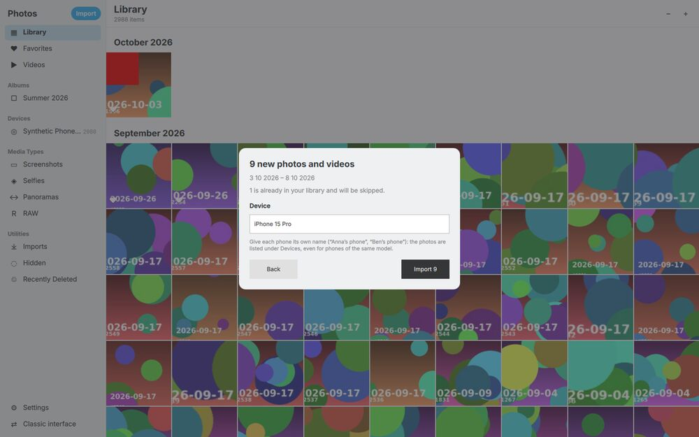
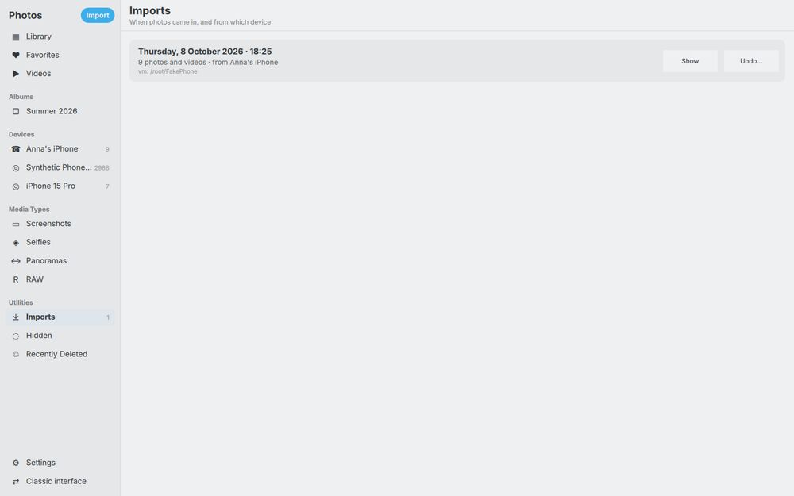
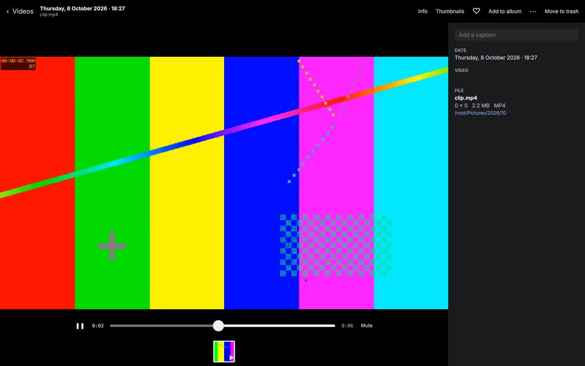
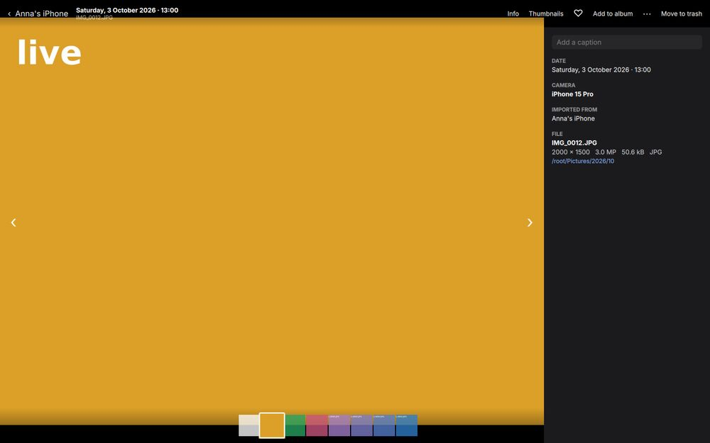

# Photos mode: files first, import, devices and library views

Photos mode keeps the library in plain folders. Everything that matters is in files a synced folder carries to other computers:

- the photos;
- an XMP sidecar next to each photo that has favorites, albums, captions, people or a device name;
- a small import record per import.

digiKam's database is a cache built from these files. Stock digiKam reads all of it.

## What is stored where

| Information | Stored as | In the files? |
|---|---|---|
| Favorite ♥ | Rating 5 (`xmp:Rating`) | Sidecar |
| Album | Tag `Albums/<name>` | Sidecar (`digiKam:TagsList`, `dc:subject`, `lr:hierarchicalSubject`) |
| Device | Import record (device name + imported files) | Import record; not in the photos' metadata |
| Hidden | Tag `Hidden` | Sidecar |
| Caption | Comment (`dc:description`, `exif:UserComment`) | Sidecar |
| People, place, date changes | Face regions (MWG), GPS, date | Sidecar |
| Import history | `<library folder>/.photos-imports/<id>.json` | Yes (hidden folder, not scanned) |
| Recently Deleted | digiKam's collection trash, `<library folder>/.dtrash/` | Yes |
| Live Photo pairs | Not stored: a photo and a video with the same name in the same folder | Yes (file names) |
| Camera (make, model, lens, exposure) | EXIF of the photo | Yes (never changed) |

## Sidecar files (default)

The first time Photos mode starts with a library, it sets digiKam's own metadata settings in its own config file, `digikam-photosrc`:

| digiKam setting | Value | Why |
|---|---|---|
| Metadata Writing Mode | Write to XMP sidecar only | The photos are never modified, so backups and syncs of the photos stay valid. Exiv2 cannot write HEIC files anyway. |
| Save rating, tags, face tags, position, captions, date, labels | On | Everything Photos mode changes goes to the sidecar. |
| Use XMP Sidecar For Reading | On | Sidecars written elsewhere are read. |
| Rescan File If Modified | On | When a photo or its sidecar changed on disk, it is read again **completely**. |

The last setting is what makes syncing work. Without it, digiKam re-reads only the size and format of a modified image, not its rating, tags or captions (`ItemScanner::scanFile(ModifiedScan)`). With it, the clean rescan replaces exactly the information that is saved to files (`ItemScanner::cleanDatabaseMetadata()` only clears the fields enabled above). An album removed on one computer is therefore removed on the other one as well.

### Switching sidecars on

**One-time catch-up.** Information that so far existed only in the database (ratings and tags set before sidecar mode, or by the classic interface with database-only settings) would be lost at the next clean rescan. So, once, about 10 s after start, Photos mode writes it to sidecars with digiKam's own maintenance tool (`MetadataSynchronizer`, database → files). This covers visible photos with a rating or a user tag and no sidecar yet. The title bar shows "saving to sidecar files N%".

**Changing the setting.** Settings (bottom of the sidebar) switches between "Save next to the photos, in sidecar files" and "Save in the library database only", which is stock digiKam's default. Switching back to sidecars runs the catch-up again.

### Tested

All tests ran in the test container.

- **Catch-up:** the 5 favorites and the album photo of the test library got sidecars with `xmp:Rating="5"` and `Albums/Summer 2026`.
- **Simulated second computer:** `xmp:Rating="5"` was added to a sidecar from outside, then Photos mode was restarted. The rating was in the database after the start-up scan.
- **Restore from Recently Deleted:** restored photos are new database entries. Their tags and caption came back from the restored sidecars.

## Import



**Import** (top of the sidebar) opens a sheet:

1. **Choose where from.**
   - Phones, cameras and memory cards are listed automatically: any mounted volume with a `DCIM` folder, also one level down, as on phones ("Internal shared storage/DCIM").
   - On Linux, phones mounted by GVfs over MTP or PTP are listed too.
   - **Choose a folder…** covers everything else: a folder or drive, or a phone shown by the file manager. The list refreshes while the sheet is open.
2. **Summary.**
   - It shows the number of new photos and videos and their date range, and how many are **already in the library**. Those are skipped: same digiKam file hash (`uniqueHash`) and size as a visible item, or the same file twice in the source. Importing the same phone again therefore brings only the new photos.
   - The device name is suggested from the camera of most new photos ("iPhone 15 Pro") and can be changed ("Anna's iPhone").
3. **Import.**
   - New files go into `<import folder>/YYYY/MM/`, by capture date (EXIF, video metadata, otherwise the file date), oldest first.
   - XMP sidecars from the source come along.
   - Each file is copied under a hidden temporary name and then renamed, so scans and folder monitoring never see a partial file. The file date is kept.
   - Each file is added to the database right away (`ScanController::scannedInfo`).
   - The device name is kept in the import record, not written to the photos: importing creates no sidecars.
4. **Done.** The sheet offers **Show** for the photos of this import. A cancelled import keeps what was copied and is recorded.

The import folder is one of digiKam's collections (Settings → Import into); collections themselves are managed in the classic interface.

### When what was imported, and undo



**Imports** (Utilities in the sidebar) lists all imports, newest first. Each shows the date, the number of files, the device, the computer and the source folder.

- **Show** opens the photos of that import as a view, whose title bar has **Undo import…**.
- **Undo** moves the files of the import that are still in the library to Recently Deleted. They can be restored from there, or with Undo in the toast. The record stays, marked "undone".

The records are small JSON files in `<library folder>/.photos-imports/`. They are synced with the library, so every computer sees the full history. digiKam does not scan hidden folders.

## Devices: whose phone

The sidebar lists:

- **named devices**: the device names given at import ("Anna's iPhone", "Ben's phone"). These tell apart phones of the same model, which EXIF alone cannot. They come from the import records, which sync with the library, so every computer has them. A photo moved or renamed outside Photos mode leaves its device. `Devices/<name>` tags written by an earlier preview are still listed, merged by name;
- **cameras**: every camera make and model found in EXIF ("iPhone 15 Pro", "Samsung SM-S918B"), also for photos that were never imported through Photos mode.

Each entry shows its number of photos, and devices without photos are not listed. Make and model are made readable: "Apple" + "iPhone 15 Pro" becomes "iPhone 15 Pro", and "samsung" + "SM-S918B" becomes "Samsung SM-S918B".

## Library views

| View | What it shows |
|---|---|
| Library, Favorites, Videos, Albums | As before; hidden photos are left out everywhere |
| Screenshots | File names of phones and desktops ("Screenshot…", "Screen Shot…", "Bildschirmfoto…", …), or PNG files without a camera |
| Selfies | Lens name containing "front" (phones name the front camera) |
| Panoramas | At least 2:1 (or 1:2), taken with a camera, not a screenshot |
| RAW | RAW formats, DNG included |
| Imports | See above |
| Hidden | Photos with the `Hidden` tag (Hide/Unhide: right-click menu, selection bar, viewer's ⋯ menu) |
| Recently Deleted | digiKam's collection trash. Restore, Delete permanently, Empty. Sidecars are restored and deleted with their photo, and restored before it, so that the scan of the restored photo reads them. |

## Live Photos and motion photos

An iPhone Live Photo is two files: `IMG_1234.HEIC` and `IMG_1234.MOV`. Photos mode pairs a photo and a video with the same name in the same folder:

- the video is not listed on its own;
- the photo gets a **LIVE** button in the viewer, which plays the motion over it.

The pairing is made from the file names when the library is listed, and nothing is stored. This way it is the same on every computer of a synced library, which digiKam's database-only grouping would not be.

Google and Samsung motion photos that embed the video in the JPEG are shown as photos, without motion, for now.

## Video



Videos play inline in the viewer through Qt Multimedia (FFmpeg backend):

- they start when opened;
- tap, Space or K plays and pauses;
- a control bar has a seek bar, the time and Mute.

The player is in its own QML file loaded through a `Loader`. On a build without the Qt Multimedia QML module, the viewer falls back to the system player, as before. The Ubuntu AppImage bundles Qt's `multimedia` plugins (FFmpeg and GStreamer backends) and, through the QML import scan, the `QtMultimedia` QML module.

## Info panel



**Info** or the I key opens a panel at the right of the viewer; the photo moves aside. It shows:

- **Caption**, editable. Enter saves it, Shift+Enter adds a new line, Esc cancels. It is saved through digiKam's caption code (`DisjointMetadata` + `FileActionMngr::applyMetadata`), so it lands in the sidecar.
- **Date**.
- **Camera**, lens, aperture, exposure, focal length, ISO.
- **Video** duration, codec and frame rate.
- **Location**: place tags if any, the coordinates, and "Show on map" (OpenStreetMap in the browser).
- **Albums** and the **device** it was imported from.
- **File** name, dimensions, megapixels, size, format, and the folder, which opens the file manager when clicked.

## Phone formats

| Format | Phones | Support |
|---|---|---|
| JPEG | All | Yes |
| HEIC / HEIF | iPhone (default), recent Samsung and Pixel | Yes, digiKam's HEIF loader (libheif). Metadata goes to sidecars: Exiv2 cannot write HEIC. |
| AVIF | Some Android phones (option) | Yes, through KDE's image plugins (`kf6-kimageformat-plugins`, now in the Ubuntu build; the Craft builds have `kimageformats`). Tested with an imported AVIF. |
| JPEG XL (`.jxl`) | Some Android phones and apps | Yes, same KDE plugins |
| DNG / ProRAW | iPhone Pro, Pixel, Samsung Expert RAW | Yes, digiKam's RAW loader (LibRaw). Not checked: the JPEG XL compressed ProRAW of recent iPhones, which needs a recent LibRaw. |
| MOV / MP4 (H.264, HEVC) | All | Yes, thumbnails and inline playback through FFmpeg. HEVC plays with software decoding where no hardware decoder is available. |
| Live Photos (HEIC + MOV) | iPhone | Yes, paired (see above) |
| Motion photos (video inside the JPEG) | Pixel, Samsung | The photo only |
| Ultra HDR / gain maps | Pixel, Samsung, iPhone | Shown as SDR (the base image) |
| Apple `.AAE` edit files | iPhone (edited photos, "Keep Originals") | Not imported; no app outside Apple's applies them. With "Transfer to Mac or PC: Automatic" the iPhone sends edited photos with the edits applied. |

## Library folders

A library can span any number of folders: an internal disk, external drives, network shares. They are digiKam's collections ("album roots"), all in one library database, so stock digiKam shows the same folders.

- **Managing them.** Settings → Library folders lists them, with **Add a folder…** and **Remove…**.
  - Removing a folder takes its photos out of the library only. The files stay where they are.
  - In sidecar mode, favorites, albums and captions come back when the folder is added again.
- **Browsing them.** The sidebar lists them under **Folders**, each showing its photos and those of its subfolders.
- **Drives that are not connected.** A folder on such a drive stays in the library, greyed out, and comes back when the drive does.

This is digiKam's model, not Apple Photos' one. Apple Photos keeps separate, self-contained libraries and switches between them. Here, one library database indexes many folders.

Separate libraries are still possible, through digiKam's "database folder": `digikam --photos --database-directory <dir>` starts on another library. A library switcher in the UI is not done.

## Opening a folder or a photo

```
digikam --photos ~/Pictures/Trip          # a folder
digikam --photos IMG_1234.HEIC            # a photo: its folder, then the viewer on it
digiKam-Photos-x86_64.AppImage ~/Pictures # the AppImage starts Photos mode by default
```

This works like `code <folder>`:

- **Relative paths** are resolved against the current directory. `file://` URLs are accepted, as file managers pass them.
- **One window.** When Photos mode already runs (same user and settings), the new process hands the paths over through a local socket (`QLocalServer`, one per user) and exits at once, about 1 s. The window comes to the front with the folder shown.
- **A folder inside a library folder** opens as a folder view; its title is the path inside the library ("2026 › 09").
- **A folder outside the library** asks: **Add "Trip" to your library?** The folder becomes a library folder, is scanned in the background, and is shown. digiKam's own check (`CollectionManager::checkLocation`) refuses folders that cannot be added, for example the parent folder of an existing library folder.
- **macOS:** folders and photos dropped on the Dock icon or opened from Finder arrive as `QFileOpenEvent` and are handled the same way.

For a short command on Linux, link the AppImage: `ln -s ~/Applications/digiKam-Photos-x86_64.AppImage ~/.local/bin/photos`, then run `photos ~/Pictures/Trip`.

Tested in the container:
- a relative subfolder handed to the running window;
- a folder outside the library, added after the prompt and scanned;
- a photo given at a cold start, opened in the viewer;
- removing a folder: database entries gone, files untouched.

### File manager integration (planned)

These all call the command above.

| Platform | How | Notes |
|---|---|---|
| Linux, all desktops | A `.desktop` entry with `MimeType=inode/directory;image/*;video/*` and `Exec=... --photos %U` | Shows up in "Open With". AppImages need an "install desktop integration" step that writes the entry with the AppImage path, as AppImageLauncher does. |
| KDE Dolphin | Service menu in `~/.local/share/kio/servicemenus/` ("Open in Photos") | Right-click on a folder or photos |
| GNOME Files, Nemo | `.desktop` "Open With", or a Nautilus script or extension | |
| Windows | Registry, per user: `HKCU\Software\Classes\Directory\shell\…` (`"%1"`), `Directory\Background\shell\…` (`"%V"`), `SystemFileAssociations\image\shell\…` | Written by the installer behind a checkbox, as VS Code does. On Windows 11 they appear under "Show more options"; the top-level menu needs a packaged `IExplorerCommand` extension. |
| macOS | `CFBundleDocumentTypes` with `public.folder` in Info.plist (open, Dock drop), and a Finder Quick Action ("Open in Photos") | The Quick Action can ship as a `.workflow` that runs `open -a`. A Finder Sync extension needs a signed app. |

## Sidecars: visibility and other applications

**Visibility.** Sidecars are ordinary, visible files: `IMG_1234.HEIC.xmp` next to `IMG_1234.HEIC`.

- They cannot simply be renamed to hidden dot-files: no other application would read `.IMG_1234.HEIC.xmp`.
- They are written only for photos with information: favorites, albums, captions, people, hidden. Importing creates none.
- The hidden folders (`.dtrash`, `.photos-imports`) are hidden on Linux and macOS by their name. On Windows Photos mode sets the hidden attribute on them.

What other applications do with a library folder (unverified points marked):

| Application | Photos and videos | Sidecars (`IMG.HEIC.xmp`) |
|---|---|---|
| File managers (Explorer, Finder, Files, Dolphin) | Shown | Shown as extra files |
| Windows Photos, macOS Preview / Photos viewer, Loupe / Eye of GNOME, Gwenview | Shown; folder structure YYYY/MM | Ignored: not images, never shown as photos. Ratings and keywords not read from sidecars. |
| digiKam (stock) | Same library | Read and written (same settings) |
| darktable | Yes | Reads the same naming (`file.ext.xmp`); rating and tags yes, its own edit history kept separately |
| Lightroom Classic, Bridge, Capture One | Yes | Expect `IMG.xmp` (no extension) and use sidecars mainly for RAW files; JPEG/HEIC metadata is read from inside the file. digiKam's "Use Compatible File Name" writes `IMG.xmp`, but then a RAW+JPEG pair shares one sidecar. (Unverified in detail.) |
| Immich, PhotoPrism (self-hosted) | Yes | Read XMP sidecars, both naming schemes (unverified here). Exclude `**/.dtrash/**` from their scans. |
| Apple Photos (import), Google Photos, OneDrive / iCloud upload | Imported | Not read by the cloud services; Apple Photos import of sidecars unverified |

**Hiding them in file managers (optional).** Settings → "Hide sidecar files in file managers" hides them without renaming them, so other applications still read them:

| Platform | How |
|---|---|
| Windows | The hidden attribute (Explorer shows them with "Hidden items") |
| macOS | Finder's hidden flag (`UF_HIDDEN`, as `chflags hidden`; Cmd+Shift+. shows them) |
| Linux | A `.hidden` file per folder listing them, followed by GNOME Files, Dolphin and other file managers; the user's own entries in it are kept |

How it is applied:
- It runs for all library folders when switched on, and again 15 s after each start, which covers sidecars synced from other computers.
- After a favorite, album or caption change, or a new or rescanned file, it runs for that photo's folder, 3 s later.
- Switching it off clears the marks, removes the sidecar entries from `.hidden` files, and deletes `.hidden` files left empty.

Attributes and flags don't travel with synced files, which is why each computer applies them again. `.hidden` files do travel, and only Linux file managers read them.

**Writing into the photo files** instead (JPEG, PNG, TIFF) would avoid extra files, but change the originals (backups, syncs, hashes), and HEIC and videos would still need sidecars. Not offered.

Tested in the container:
- importing 8 photos added no sidecars, and the device showed in the sidebar, its view and the Info panel;
- switching hiding on wrote `.hidden` files listing exactly the sidecars of each folder;
- a sidecar created by a new favorite was added to `.hidden` within seconds;
- switching it off removed the sidecar entries and kept a user entry.

## Known gaps

- **Phones on Windows and macOS.** They are not mounted as folders: an iPhone appears as an MTP or Apple device, not a drive. A phone sync app (PhotoSync, Syncthing, Nextcloud, OneDrive) can put the photos in a folder, which is then imported or set as the import source. digiKam's gphoto2 camera import could reach them on Linux and macOS, and is not wired to Photos mode yet.
- **"Delete from the phone after import"** is not offered yet.
- **Counts.** Device counts include the videos of Live Photos.
- **Import views list Live Photo videos.** The view of an import or of a device lists every imported file, including the video of a Live Photo.
- **Videos written while scanned.** A video still being written when folder monitoring scans it, for example one recorded straight into the library, gets no duration and size until it changes again. Imports are not affected: they copy under a temporary name.
